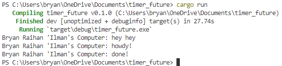

# Experiments

## 1.2 Understanding how it works.

Dari output yang ada, terlihat bahwa pesan "hey hey" muncul terlebih dahulu. Ini karena pesan "hey hey" berada di luar fungsi async. Program akan melanjutkan eksekusi sementara masih menunggu hasil dari proses async. Oleh karena itu, "hey hey" muncul terlebih dahulu, diikuti oleh pesan yang ada di dalam fungsi async. Fungsi asinkronus ditandai dengan kata kunci `async` sebelum kurung kurawal.
