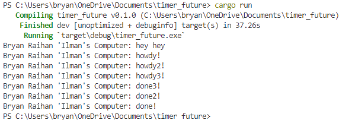

# Experiments

## 1.2. Understanding how it works.

Dari output yang ada, terlihat bahwa pesan "hey hey" muncul terlebih dahulu. Ini karena pesan "hey hey" berada di luar fungsi async. Program akan melanjutkan eksekusi sementara masih menunggu hasil dari proses async. Oleh karena itu, "hey hey" muncul terlebih dahulu, diikuti oleh pesan yang ada di dalam fungsi async. Fungsi asinkronus ditandai dengan kata kunci `async` sebelum kurung kurawal.

## 1.3. Multiple Spawns and Removing drop()

### drop(spawner) removed

### drop(spawner) not removed

Ketika drop(spawner) dihilangkan, program akan terus berjalan tanpa berhenti. Ketika suatu spawner memanggil fungsi spawn, task baru akan dibuat dan dikirimkan ke task sender. Executor akan mengeksekusi satu task dari task sender. Kemudian, executor akan mengambil task lainnya secara berurutan hingga task sender kosong. Setelah drop(spawner) dipanggil, interaksi dianggap selesai, dan spawner akan dihapus, yang membuat program berhenti.
